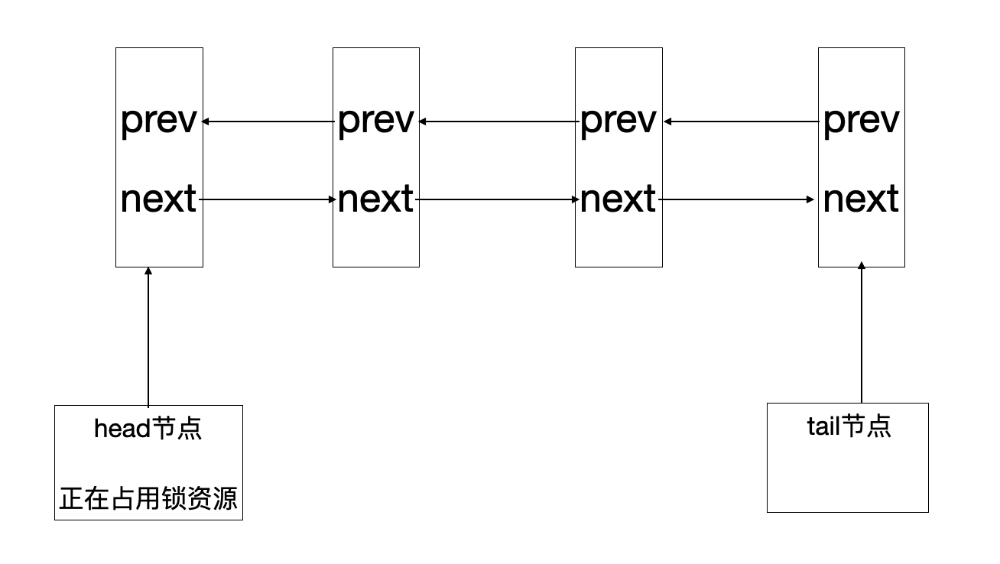

AbstractQueuedSynchronizer(为了方便，以下称为AQS)是JDK中一个非常重要的基础同步组件，我们日常用到的类似ReentrantLock，CountDownLatch等都是基于AQS来实现的。

本系列大概会分为3-4篇文章来分析，包括了AQS的源码和基于AQS来实现的同步组件的源码。

我会尽力写得清晰明了，希望能对得起大家花的时间，如果有写得不对的或者模糊不清的，大家可以指出，一起讨论。


## 前言

大家可能都知道ReentrantLock是基于AQS来实现的，那么到底是怎么实现的，本文从ReentrantLock非公平锁入手，一步步来分析整个源码。

在分析ReentrantLock和AbstractQueuedSynchronizer之前，我们先来看看ReentrantLock是怎么用的？

一段典型的ReentrantLock锁的用法是：

```java
	  private Lock lock = new ReentrantLock();
    public void saleTickets(){
        lock.lock();
        try {
            //do something
        }finally {
            lock.unlock();
        }
    }
```

因为业务代码可能会抛出异常，导致锁不能被释放，所以需要在finally语句块中释放锁资源。


## ReentrantLock类结构

下面我们从ReentrantLock类入手来分析，看看内部是什么样子的。

 在ReentrantLock内部有一个静态内部类Sync，它继承了AbstractQueuedSynchronizer类，用来管理锁的获取和释放。

```java
abstract static class Sync extends AbstractQueuedSynchronizer {
        private static final long serialVersionUID = -5179523762034025860L;
        abstract void lock();
}
```

而在其内部还有两个静态内部类：NonfairSync和FairSync，它们均继承自内部类Sync，从名字我们看出来，这就是所说的非公平锁和公平锁。

```java
static final class NonfairSync extends Sync {
}
static final class FairSync extends Sync {
}
```

当我们通过 `Lock lock = new ReentrantLock();`  创建一个锁对象时，实则是创建了一个非公平锁。

```java
public ReentrantLock() {
        sync = new NonfairSync();
    }
```

当然如果需要创建一个公平锁，则可以通过构造函数传入true即可。

```java
public ReentrantLock(boolean fair) {
        sync = fair ? new FairSync() : new NonfairSync();
    }
```


## AbstractQueuedSynchronizer类结构

说完了ReentrantLock的类结构，我们再来大致的分析下AQS的结构，大致了解了原理后才能去看源码。

AQS其实是利用了 `双向链表` 这种特殊的数据结构来实现多个线程的等待和唤醒，大致说来就是：

1. 在多个线程调用lock()方法，同时争抢锁资源时，保证只会有一个线程能抢占到锁资源，其余线程会被封装成一个Node对象，构成一个双向链表结构，然后线程就处于waiting状态，等待被唤醒。

   > 这里是怎么保证只有一个线程能获取到锁呢？其实是通过CAS的方式来读写一个volatile的变量state的值来实现的。当state的值为0时，代表没有锁资源没有被占用，当state的值等于1时，代表锁资源被占用。这里需要注意的是，因为锁是支持重入的，虽然不允许不同的线程同时获取一个锁，但是允许同一个线程可以多次获取同一个锁，所以对于互斥锁而言state的值也是可能大于1的，而且在对state的值进行更新时，要将获取到锁资源的线程保存起来，用于后续判断锁是不是重入了。

2. 在获取到锁资源的线程执行完临界代码，并调用unlock()释放锁资源时，会唤醒链表中的第一个节点(这里也不准确，会唤醒链表中最前面的满足唤醒条件的节点)。



我们之前说过，链表中的节点是一个个的Node对象，它存在于AQS内部，是一个静态内部类，下面我们来看一下它的结构。

建议大家打开IDE，对着源码一起看。

```java
 static final class Node {
				
        static final Node SHARED = new Node();
        
        static final Node EXCLUSIVE = null;

        static final int CANCELLED =  1;
      
        static final int SIGNAL    = -1;
       
        static final int CONDITION = -2;
        
        static final int PROPAGATE = -3;

   			/**上面的几个数字就是waitStatus的取值，本篇文章涉及到的只有1，-1和0这三个值。
   				 有人会问上面取值没有0啊，实际上是不给waitStatus赋值时，会被初始化为0。
   				 -2和-3分别用于条件队列和共享锁，暂时不涉及到**/
        volatile int waitStatus;				

   			/**这两个就是构成双向链表的关键参数，用于保存当前节点的上一个和下一个节点的引用**/
        volatile Node prev;
        volatile Node next;
				/**这个就是线程本身了，我们知道在Java中线程就是用Thread来表示的**/
        volatile Thread thread;
				/**构成条件队列的参数，本篇文章不会涉及到**/
        Node nextWaiter;
}
```

那么有人说了，上面示意图中有两个参数head和tail呢，head和tail是构成链表哨兵节点，不属于Node节点中的属性，是属于AQS类的属性。

```java
	public abstract class AbstractQueuedSynchronizer{
		private transient volatile Node head;
    private transient volatile Node tail;
    
    //上文提到的通过读写state的值来进行加锁，这就是state
    private volatile int state;
  }
```

## 源码分析

上面说完了基本结构，大家心里对AQS的实现应该已经有了大致的概念。

下面我们将跟着源码一起学习，学习大神的代码，强烈建议大家打开源码，一步步对着看，不然肯定一头雾水。

当我们调用ReentrantLock类的lock方法时，实际上默认是调用的NonfairSync的lock()方法。

```java
					final void lock() {
            /**我们说过，加解锁都是通过CAS的方式来更新state的值，这里就是试图通过CAS的方式将0替换为1，即进行加锁操作。
            	 这里是第一次试图抢占锁**/
            if (compareAndSetState(0, 1))
              	/**上面的CAS执行成功会进入这里，加锁成功后，将加锁成功的线程设置为有效线程，即当前获取到锁的线程，
              	   这里是为了判断锁的重入**/
                setExclusiveOwnerThread(Thread.currentThread());
            else
                /**加锁失败，会进入到这一步**/
                acquire(1);
        }
```

在第一次试图抢占锁失败后，会进入到acquire()方法。

```java
public final void acquire(int arg) {
  			/**tryAcquire()方法，从名字可以看出来是尝试获取锁**/
        if (!tryAcquire(arg) &&
            acquireQueued(addWaiter(Node.EXCLUSIVE), arg))
            selfInterrupt();
    }

```

从tryAcquire()往下，可以直接找到nonfairTryAcquire()方法。

```java
final boolean nonfairTryAcquire(int acquires) {
            final Thread current = Thread.currentThread();
            int c = getState();
            if (c == 0) {
                /**这里和之前的一样，如果state的值为0，代表没有线程占用锁资源，则第二次试图抢占锁资源**/
                if (compareAndSetState(0, acquires)) {
                    setExclusiveOwnerThread(current);
                    return true;
                }
            }
            else if (current == getExclusiveOwnerThread()) {
                /**这里就是我们前面提到的判断锁是否重入了。当state的值大于1时，判断一下占用锁的线程是不是自己，是自己则把state
                    的值+1就可以**/
                int nextc = c + acquires;
                if (nextc < 0) // overflow
                    throw new Error("Maximum lock count exceeded");
                setState(nextc);
                return true;
            }
  					//若进入这里，则代表锁资源被其他线程占用，返回false，抢占锁失败。
            return false;
        }
```

tryAccquire()执行完后，会返回到这里

```java
public final void acquire(int arg) {
  			/**tryAcquire()方法，从名字可以看出来是尝试获取锁。
  				 如果这个方法返回true，则代表获取到了锁，那么取反，则为false，不会进入到下面的判断中，
  				 整个lock()方法就已经执行结束了。获取到锁的线程会继续往下执行临界代码。**/
        if (!tryAcquire(arg) &&
            /**当tryAcquire()返回false，即加锁失败后，会进入到addWaiter()方法中**/
            acquireQueued(addWaiter(Node.EXCLUSIVE), arg))
            selfInterrupt();
    }
```

```java
private Node addWaiter(Node mode) {
        /**将当前线程构建成Node对象，注意这里没有设置waitStatus的值，所以默认为0**/
        Node node = new Node(Thread.currentThread(), mode);
        Node pred = tail;
        if (pred != null) {
            /**当tail节点不是null时，则说明链表结构已经存在了，这时需要将当前Node添加到链表的末尾。
            		先把Node的prev指向前一个节点**/
            node.prev = pred;
            /**通过CAS的方式将当前Node节点设置为tail**/
            if (compareAndSetTail(pred, node)) {
                /**若设置成功，把前一个节点的next指向自己，这样就完成了把当前Node节点链接到双向链表中的操作**/
                pred.next = node;
                return node;
            }
        }
  			/**到这里，说明现在链表结构还是不存在的，需要构建**/
        enq(node);
        return node;
    }
```

```java
private Node enq(final Node node) {
        for (;;) {
            /**注意这里是一个死循环，唯一跳出的方式就是return**/
            Node t = tail;
            if (t == null) { // Must initialize
              	/**链表不存在，则先新建一个Node对象，并用head指向它。这里需要注意，head节点实际上并不是我们的线程节点，是我们
              	   自己新建的一个为空的Node节点**/
                if (compareAndSetHead(new Node()))
                    tail = head;
            } else {
                /**上一步完成head和tail的初始化后，会返回，但是因为是一个死循环，所以第二次循环会进入到这里，将当前节点设置为
                		tail，并链接到链表中，然后就返回了，跳出了循环**/
                node.prev = t;
                if (compareAndSetTail(t, node)) {
                    t.next = node;
                    return t;
                }
            }
        }
    }
```

addWaiter()方法执行完后，则会返回到这里，继续执行acquireQueued()方法。

```java
public final void acquire(int arg) {
  			/**tryAcquire()方法，从名字可以看出来是尝试获取锁。
  				 如果这个方法返回true，则代表获取到了锁，那么取反，则为false，不会进入到下面的判断中，
  				 整个lock()方法就已经执行结束了。获取到锁的线程会继续往下执行临界代码。**/
        if (!tryAcquire(arg) &&
            /**当tryAcquire()返回false，即加锁失败后，会进入到addWaiter()方法中。
               addWaiter()方法返回后，会继续执行acquireQueued()**/
            acquireQueued(addWaiter(Node.EXCLUSIVE), arg))
            selfInterrupt();
    }
```

```java
final boolean acquireQueued(final Node node, int arg) {
        boolean failed = true;
        try {
            boolean interrupted = false;
            for (;;) {
                /**这里依然是一个死循环，其实我们并不需要太关注这个node节点到底是哪一个，不信往下看。
                	 node.predecessor()返回的是这个node节点的前一个节点**/
                final Node p = node.predecessor();
                /**如果node节点的前一个节点就是head，我们说过，head节点实际上并不是我们真正的线程节点，只是一个空的Node，那么
                   说明这个node排在双向链表的第一个，那这个时候就可以尝试以下去获取锁了，为什么呢？因为此时没有线程和自己抢占
                   锁，而且有可能锁已经被释放了**/
                if (p == head && tryAcquire(arg)) {
                    /**抢占锁成功后，直接返回，并把自己设置为head节点**/
                    setHead(node);
                    p.next = null; // help GC
                    failed = false;
                    return interrupted;
                }
               /**到这里，说明node不是链表的第一个节点，或者抢占锁失败了，会进入到shouldParkAfterFailedAcquire()，
                  当返回false时，不会继续执行parkAndCheckInterrupt()，会继续往下执行，但因为实际上是个死循环，
                  会第二次进入shouldParkAfterFailedAcquire()方法，这个时候就会直接返回true。然后就会执行
                  parkAndCheckInterrupt()方法，让线程处于等待被唤醒，到这里，没有获取到锁的线程就已经处于了waiting状态**/
                if (shouldParkAfterFailedAcquire(p, node) &&
                    parkAndCheckInterrupt())
                    interrupted = true;
            }
        } finally {
            if (failed)
                cancelAcquire(node);
        }
    }

/**把node节点设置为head节点，并把thread置为null，所以这里其实我们可以看到，在创建链表结构的时候，head是一个空的Node对象，
	 在后面的过程中，head就会变成获取到锁，正在执行的节点**/
 private void setHead(Node node) {
        head = node;
        node.thread = null;
        node.prev = null;
    }

 /**这里我们可以知道，pred是node的前一个节点**/
 private static boolean shouldParkAfterFailedAcquire(Node pred, Node node) {
        int ws = pred.waitStatus;
        if (ws == Node.SIGNAL)
            /**如果前一个节点的waitStatus是-1，直接返回true。
            	 因为外层是一个死循环，所以第二次进入这里，会直接返回true**/
            return true;
        if (ws > 0) {
          /**如果前一个节点的waitStatus是大于0，这里我们说过我们只考虑1，0和-1的，所以这里指的就是1.
          	 如果waitStatus的值等于1怎么样呢？向前遍历，找到一个节点的waitStatus的值等于-1的，
          	 然后把node节点链接到这个节点的后面。这里我们理解为线程节点需要依赖前一个节点，
          	 必须找到一个处于正常状态的节点。那么什么时候节点状态不正常呢，就是什么时候节点的状态会为1呢？**/
            do {
                node.prev = pred = pred.prev;
            } while (pred.waitStatus > 0);
            pred.next = node;
        } else {
            /**什么情况下会到这里？waitStatus的状态为0，这个时候，通过CAS的方式将前一个节点的状态改为-1。
            	 我们之前说过，线程节点必须要找到前一个节点状态为-1的节点作为其父节点，但实际上我们之前从来
            	 没有设置过waitStatus的值，所以默认为0，这里把前一个节点的状态改为-1，实际上代表了前一个节点的
            	 后一个节点需要被唤醒，**/
            compareAndSetWaitStatus(pred, ws, Node.SIGNAL);
        }
        /**到这里，返回false**/
        return false;
    }

/**真正执行线程等待的方法**/
private final boolean parkAndCheckInterrupt() {
  			/**还记得我们之前说过，没有获取到锁资源的线程会处于等待状态，等待被唤醒，这里就是真正的代码**/
        LockSupport.park(this);
        return Thread.interrupted();
    }

```

到这里，实际上lock()方法就已经执行完毕了，没有获取到锁的线程处于等待状态，等待被唤醒。

讲完了加锁，下面来讲讲解锁。

当调用unlock()时，实际上是调用了release()方法。

```java
public final boolean release(int arg) {
        /**释放锁**/
        if (tryRelease(arg)) {
            Node h = head;
            if (h != null && h.waitStatus != 0)
                /**当有线程在等待唤醒，且waitStatus不等于0时，唤醒阻塞队列的节点
                   这里为什么要加这个!=0的判断？因为我们上面说过，节点的waitStatus的值是后继节点设置的，当有线程需要被唤醒时，
                   会把自身的父节点的waitStauts更新为-1，所以如果head节点等于0，其实是没有节点需要被唤醒的**/
                unparkSuccessor(h);
            return true;
        }
        return false;
    }

/**释放锁，因为锁可能会重入，所以这里需要多次更新state的值，只有最终更新为0后，才算释放锁成功**/
protected final boolean tryRelease(int releases) {
            int c = getState() - releases;
            if (Thread.currentThread() != getExclusiveOwnerThread())
                throw new IllegalMonitorStateException();
            boolean free = false;
            if (c == 0) {
                free = true;
                setExclusiveOwnerThread(null);
            }
            setState(c);
            return free;
        }

/**唤醒阻塞队列的最前面的节点，这里的node实际上是head节点**/
private void unparkSuccessor(Node node) {
        
        int ws = node.waitStatus;
        if (ws < 0)
            /**通过CAS的方式将head节点的waitStatus改为0**/
            compareAndSetWaitStatus(node, ws, 0);
  
        Node s = node.next;
        /**如果head节点的下一个节点的waitStauts等于1。则从前往后开始遍历，找到第一个waitStauts等于-1的节点唤醒**/
        if (s == null || s.waitStatus > 0) {
            s = null;
            for (Node t = tail; t != null && t != node; t = t.prev)
                if (t.waitStatus <= 0)
                    s = t;
        }
        if (s != null)
            /**唤醒节点**/
            LockSupport.unpark(s.thread);
    }
```

到这里，整个unlock()就结束了，被唤醒的节点将从下面继续执行。

```java
final boolean acquireQueued(final Node node, int arg) {
        boolean failed = true;
        try {
            boolean interrupted = false;
            for (;;) {
                /**这里依然是一个死循环，其实我们并不需要太关注这个node节点到底是哪一个，不信往下看。
                	 node.predecessor()返回的是这个node节点的前一个节点**/
                final Node p = node.predecessor();
                /**如果node节点的前一个节点就是head，我们说过，head节点实际上并不是我们真正的线程节点，只是一个空的Node，那么
                   说明这个node排在双向链表的第一个，那这个时候就可以尝试以下去获取锁了，为什么呢？因为此时没有线程和自己抢占
                   锁，而且有可能锁已经被释放了**/
                if (p == head && tryAcquire(arg)) {
                    /**抢占锁成功后，直接返回，并把自己设置为head节点**/
                    setHead(node);
                    p.next = null; // help GC
                    failed = false;
                    return interrupted;
                }
               /**到这里，说明node不是链表的第一个节点，或者抢占锁失败了，会进入到shouldParkAfterFailedAcquire()，
                  当返回false时，不会继续执行parkAndCheckInterrupt()，会继续往下执行，但因为实际上是个死循环，
                  会第二次进入shouldParkAfterFailedAcquire()方法，这个时候就会直接返回true。然后就会执行
                  parkAndCheckInterrupt()方法，让线程处于等待被唤醒，到这里，没有获取到锁的线程就已经处于了waiting状态**/
                if (shouldParkAfterFailedAcquire(p, node) &&
                    parkAndCheckInterrupt())
                    interrupted = true;
            }
        } finally {
            if (failed)
                cancelAcquire(node);
        }
    }

/**真正执行线程等待的方法**/
private final boolean parkAndCheckInterrupt() {
  			/**还记得我们之前说过，没有获取到锁资源的线程会处于等待状态，等待被唤醒，这里就是真正的代码**/
        LockSupport.park(this);
        return Thread.interrupted();
    }
```

被唤醒的节点从parkAndCheckInterrupt()中返回，继续执行上面的for循环，这个时候node的前一个节点就是head节点了。继续执行上面抢占锁的操作，成功后，把自己设置为head节点，然后，就从整个lock()方法中返回了，继续执行临界代码。

## 总结

讲完了加锁和解锁的机制，下面来做个总结。

1. 加锁时，通过CAS的方式将state的值改为1，并将获取到锁资源的线程设置为有效线程。其余未获取到锁资源的线程会被封装成一个Node对象，形成一条双向链表，也叫做阻塞队列，并通过LockSupport.park()将线程挂起。
2. 当获取到锁资源的线程执行完临界代码，释放锁资源时，依然是通过CAS的方式将state的值改为0，并将有效线程设置为null，唤醒阻塞队列中head节点的后一个满足唤醒条件的节点。这里需要注意的是，head节点是获取到锁资源，正在执行临界代码的线程，不包含在阻塞队列中。